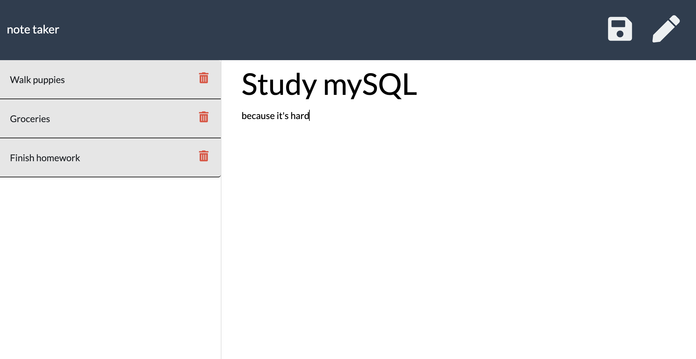

# Note Taker Application

## Description

This app will allow a user to create and save notes, view previously saved notes, and delete previously saved notes. For people who need to keep track of a lot of information, it's easy to forget or be unable to recall something important. Being able to take persistent notes allows users to have written information available when needed.

## Usage

Use this [note taker app](https://stormy-garden-29411.herokuapp.com/) when you need to create a note.  [Here](https://drive.google.com/file/d/14vSCg4P-FIgnjmqJm85uwd_9bgPRV5T3/view?usp=sharing "Link to video showing how to use this app") is a short video showing how to use this application.

## Screenshot

## Prerequisites

* NodeJS

## Technologies

* HTML
* CSS
* Javascript
* NodeJS
    * Express

## Information

If you have any questions about this project, you can open an issue or contact me directly at shay@shaydaniel.com. You can find more of my work on Github at [shaydaniel7](https://github.com/shaydaniel7/).  [Here](https://github.com/shaydaniel7/notetaker "Link to github repository") is the github repository for this project.

